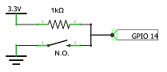

# bThings GPIO Library
## Overview
Mongoose-OS library that allows you to easily attach a [bThing](https://github.com/diy365-mgos/bthing) to a GPIO.
## Get Started
Include the library in your `mos.yml` file.
```yaml
libs:
  - origin: https://github.com/diy365-mgos/bthing-gpio
```
**C/C++ firmware samples** - Copy and paste one of the following examples in your `main.c` project file.

Example #1 - Create a *bActuator* for toggling the GPIO 2 state.

Additionally, include the [bActuators library](https://github.com/diy365-mgos/bactuator) in your `mos.yml` file.
```yaml
libs:
  - origin: https://github.com/diy365-mgos/bactuator
```
```c
#include "mgos.h"
#include "mgos_bactuator.h"
#include "mgos_bthing_gpio.h"

static int gpio_pin = 2; // LED GPIO
static mgos_bvar_t new_state;

static void actuator_state_published_cb(int ev, void *ev_data, void *userdata) {
  mgos_bactuator_t actu = (mgos_bactuator_t)ev_data;
  mgos_bthing_t thing = MGOS_BACTUATOR_THINGCAST(actu);
  mgos_bvarc_t state = mgos_bthing_get_state(thing);

  LOG(LL_INFO, ("The GPIO %d (actuator '%s') state: %s",
    gpio_pin, mgos_bthing_get_id(thing), (mgos_bvar_get_bool(state) ? "TRUE" : "FALSE")));
}

void actuator_toggle_state(void *param) {
  mgos_bactuator_t actu = (mgos_bactuator_t)param;
  mgos_bthing_t thing = MGOS_BACTUATOR_THINGCAST(actu);

  mgos_bvar_set_bool(new_state, mgos_bvar_get_bool(mgos_bthing_get_state(thing)) ? false : true);
  mgos_bthing_set_state(thing, new_state);

  (void) param;
}

enum mgos_app_init_result mgos_app_init(void) {
  new_state = mgos_bvar_new();
  mgos_event_add_handler(MGOS_EV_BTHING_PUBLISHING_STATE, actuator_state_published_cb, NULL);

  /* create the sensor */
  mgos_bactuator_t a = mgos_bactuator_create("actu1", MGOS_BTHING_PUB_STATE_MODE_CHANGED);
  /* attach GPIO  */
  mgos_bthing_gpio_attach(MGOS_BACTUATOR_THINGCAST(a), gpio_pin, false, true);

  // Simulate an external trigger for changing actuator state
  mgos_set_timer(5000, MGOS_TIMER_REPEAT, actuator_toggle_state, a);
  
  return MGOS_APP_INIT_SUCCESS;
}
```
Example #2 - Create a *bSensor* for reading a *pressed/released* button state. Before running the code sample, you must wire your boardas indicated in the schema below. 



Additionally, include the [bSensors library](https://github.com/diy365-mgos/bsensor) in your `mos.yml` file.
```yaml
libs:
  - origin: https://github.com/diy365-mgos/bsensor
```
```c
#include "mgos.h"
#include "mgos_bsensor.h"

static int gpio_pin = 14;

static bool sensor_get_state_cb(mgos_bthing_t thing, mgos_bvar_t state, void *userdata) {
  mgos_bvar_set_bool(state, mgos_gpio_read(gpio_pin));
  return true;
}

static void sensor_state_published_cb(int ev, void *ev_data, void *userdata) {
  mgos_bsensor_t sens = (mgos_bsensor_t)ev_data;
  mgos_bthing_t thing = MGOS_BSENSOR_THINGCAST(sens);
  mgos_bvarc_t state = mgos_bthing_get_state(thing);

  LOG(LL_INFO, ("The button '%s' (on GPIO %d) has been %s.",
    mgos_bthing_get_id(thing), gpio_pin, (mgos_bvar_get_bool(state) ? "RELEASED" : "PUSHED")));
}

enum mgos_app_init_result mgos_app_init(void) {

  mgos_event_add_handler(MGOS_EV_BTHING_PUBLISHING_STATE, sensor_state_published_cb, NULL);

  /* create the sensor */
  mgos_bsensor_t s = mgos_bsensor_create("btn1", MGOS_BTHING_PUB_STATE_MODE_CHANGED);
  /* set the get-state handler */
  mgos_bthing_on_get_state(MGOS_BSENSOR_THINGCAST(s), sensor_get_state_cb, NULL);
  /* set sensor read polling every 2 secs. */
  mgos_bsensor_interrupt_set(s, gpio_pin, MGOS_GPIO_PULL_UP, MGOS_GPIO_INT_EDGE_ANY, 50);
  
  return MGOS_APP_INIT_SUCCESS;
}
```
## C/C++ API Reference
### mgos_bthing_gpio_attach
```c
bool mgos_bthing_gpio_attach(mgos_bthing_t thing, int pin, bool active_high, bool init_gpio);
```
Attaches a *bThing* to the specified GPIO. Returns `true` on success, or `false` otherwise.

|Property||
|--|--|
|thing|A *bThing*.|
|pin|The GPIO pin.|
|active_high|`true` if GPIO is on when output is high (1).|
|init_gpio|`true` to initialize GPIO [mode](https://mongoose-os.com/docs/mongoose-os/api/core/mgos_gpio.h.md#mgos_gpio_set_mode) and [pull](https://mongoose-os.com/docs/mongoose-os/api/core/mgos_gpio.h.md#mgos_gpio_set_pull).|

**Remarks**

If `init_gpio` is `true`, the GPIO is initialized according the *bThing* type and the `active_high` value.

|active_high|MGOS_BTHING_TYPE_SENSOR|MGOS_BTHING_TYPE_ACTUATOR|
|--|--|--|
|`true`|MGOS_GPIO_MODE_INPUT<br>MGOS_GPIO_PULL_DOWN|MGOS_GPIO_MODE_OUTPUT<br>MGOS_GPIO_PULL_DOWN|
|`false`|MGOS_GPIO_MODE_INPUT<br>MGOS_GPIO_PULL_UP|MGOS_GPIO_MODE_OUTPUT<br>MGOS_GPIO_PULL_UP|
## To Do
- Implement javascript APIs for [Mongoose OS MJS](https://github.com/mongoose-os-libs/mjs).
